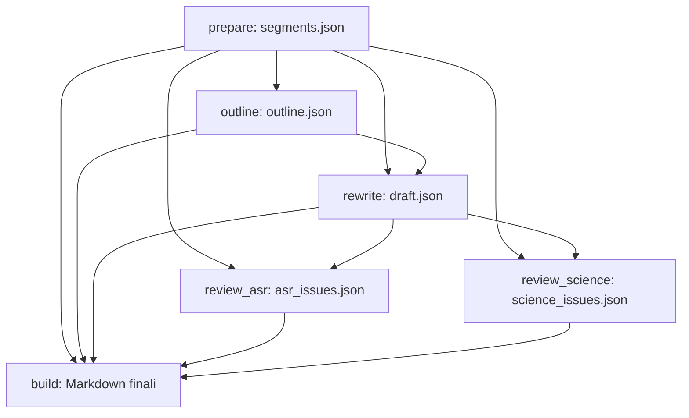

# Architettura del Sistema RT 2.0

## 1. Visione Generale

Il sistema RT 2.0 è progettato per risolvere la fragilità insita nei workflow che utilizzano il linguaggio naturale e il Markdown come protocolli di stato interno.

```text
                    ┌─────────────────────┐
                    │      AUDIO/ASR      │
                    │   (MacWhisper mw)   │
                    └──────────┬──────────┘
                               ↓
                    ┌─────────────────────┐
                    │ SEGMENTS + TIMESTAMP│ (Codice Deterministico)
                    │   (segments.json)   │
                    └──────────┬──────────┘
                               ↓
                    ┌─────────────────────┐
                    │   GLOBAL OUTLINE    │ (LLM: coordinate segment_id)
                    │    (outline.json)   │
                    └──────────┬──────────┘
                               ↓
                    ┌─────────────────────┐
                    │  CHAPTER REWRITE    │ (LLM: sliding window + provenance)
                    │     (draft.json)    │
                    └──────────┬──────────┘
                               ↓
                    ┌─────────────────────┐
                    │ DETERMINISTIC CHECK │ (Validazione monotonicità e copertura)
                    └──────────┬──────────┘
                               ↓
                 ┌─────────────┴─────────────┐
                 ↓                           ↓
        ┌────────────────┐          ┌────────────────┐
        │   ASR REVIEW   │          │ SCIENCE REVIEW │
        │  (GREEN/YELLOW/│          │ (Critic: DOC/  │
        │      RED)      │          │ RECON/CHECK)   │
        └───────┬────────┘          └───────┬────────┘
                └─────────────┬─────────────┘
                              ↓
                    ┌─────────────────────┐
                    │  HUMAN REVIEW ONLY  │ (Solo YELLOW/RED)
                    │(review_decisions.js)│
                    └──────────┬──────────┘
                               ↓
                    ┌─────────────────────┐
                    │ DETERMINISTIC BUILD │ (Assemblaggio Markdown puro)
                    │  (rielaborato.md)   │
                    └──────────┬──────────┘
                               ↓
                    ┌─────────────────────┐
                    │ TELEGRAM / OBSIDIAN │
                    └─────────────────────┘
```

---

## 2. Separazione delle Responsabilità

### Responsabilità Deterministica (Codice Python Puro)
- Normalizzazione e parsing dei timestamp in secondi (`float`).
- Generazione degli ID stabili dei segmenti (`seg_000001` ... `seg_N`).
- Tracciamento della macchina a stati in `info.yaml` e `manifest.json`.
- Validazione dell'outline: verifica che i segmenti esistano, siano ordinati cronologicamente e che non ci siano inversioni temporali.
- Calcolo della copertura del trascritto (percentuale coperta, segmenti omessi).
- Confidence gating numerico delle issue ASR.
- Persistenza del `review_decisions.json` (decision ledger).
- Final build: rendering del Markdown con timestamp rigorosamente calcolati dalla formula `segments[start_segment_id].start_seconds`.

### Responsabilità Cognitiva (Job LLM Specializzati)
- **Outline Job**: analisi concettuale del contenuto globale e ripartizione in macro-argomenti e unità didattiche brevi (2-6 minuti).
- **Rewrite Job**: riscrittura in prosa accademica fluida, eliminando il parlato e garantendo continuità didattica senza allucinare dettagli esterni.
- **ASR Review Job**: individuazione delle parole stravolte dall'ASR e proposta di correzioni fonetico-biomediche.
- **Science Review Job (Critic)**: revisione avversaria indipendente per identificare contraddizioni scientifiche distinguendo errori del docente da allucinazioni della ricostruzione.

### Responsabilità Umana (Human-in-the-Loop)
- Intervento limitato esclusivamente ai casi a media/bassa confidenza (**YELLOW** e **RED**), con ascolto audio contestualizzato (`Ascolta MM:SS - MM:SS`).

---

## 3. Gestione della Provenance e Garanzia sui Timestamp

Il problema principale dei sistemi LLM tradizionali è l'allucinazione temporale: l'LLM inserisce timestamp plausibili ma non accurati (es. `36:30` generato come stringa).

Nel nostro sistema:
1. All'LLM è severamente vietato restituire timestamp nei campi dell'outline o del draft.
2. L'LLM restituisce unicamente `start_segment_id: "seg_000184"`.
3. Il renderer deterministico esegue:
   ```python
   start_sec = segments_dict["seg_000184"].start_seconds
   rendered_timestamp = format_timestamp(start_sec)
   ```
4. Se il segmento non esiste nei metadati sorgente, la pipeline si blocca con un errore esplicito.
5. In questo modo si garantisce in modo deterministico che nessun timestamp nel documento finale sia disallineato rispetto a `segments.json`.

> **Nota di precisione**: Questa garanzia copre la coerenza deterministica tra il documento finale e `segments.json`; l'accuratezza di `segments.json` rispetto alla registrazione reale dipende a sua volta dalla correttezza del parsing iniziale della trascrizione grezza.

---

## 4. LLM Routing Engine, Multi-Provider Architecture e Telemetria

Il sottosistema LLM di RT 2.0 disaccoppia interamente i 4 job cognitivi (`outline`, `rewrite`, `review_asr`, `review_science`) dai provider fisici e dalle credenziali attraverso un Routing Engine centrale, multi-provider e multi-modello:

```text
RT Cognitive Jobs (outline, rewrite, review_asr, review_science)
                               ↓
                        LLMClient Gateway
                               ↓
                  ┌─────────────────────────┐
                  │   RoutingEngine (RT)    │
                  │ - Round-Robin Scheduler │
                  │ - Error-Aware Failover  │
                  │ - Loop Protection       │
                  │ - Output Explosion Guard│
                  └────────────┬────────────┘
                               ↓
                  ┌─────────────────────────┐
                  │   CredentialRegistry    │
                  │ (google_1, google_2,    │
                  │  openrouter, deepseek)  │
                  └────────────┬────────────┘
         ┌─────────────────────┼─────────────────────┬─────────────────────┐
         ↓                     ↓                     ↓                     ↓
   Google Gemini        Google Gemini             DeepSeek            OpenRouter
 (Project 1: google_1) (Project 2: google_2) (api.deepseek.com)  (openrouter.ai/api/v1)
```

### Caratteristiche Chiave:

1. **Scheduling Policy (Primary vs Round-Robin)**:
   - Ciascun job può definire una route `primary` e una route `secondary`.
   - Con `round_robin: true`, le chiamate successive dello stesso job alternano in modo deterministico e thread-safe tra primary e secondary (utile per distribuire il carico tra due progetti Google Gemini con quote indipendenti).

2. **Google Dual-Key (Due Progetti Indipendenti)**:
   - Supporto nativo per due account/progetti Google distinti (`google_1` mappato su `GOOGLE_API_KEY_1`, `google_2` mappato su `GOOGLE_API_KEY_2`).
   - Quote e rate limit separati con failover trasparente tra le chiavi.

3. **Tassonomia degli Errori & Error-Aware Failover**:
   Tutti gli errori HTTP e i blocchi del provider vengono classificati in classi formali:
   - `TimeoutFailure`: deadline wall-clock superata -> esaurisce eventuali retry bounded locali sulla stessa route, poi commuta su `fallback.timeout`.
   - `RateLimitFailure`: HTTP 429 / quota esaurita -> commuta immediatamente su `fallback.rate_limit`.
   - `SafetyFailure`: content filter / promptFeedback / finishReason Gemini/OpenRouter -> commuta su `fallback.safety`.
   - `AuthenticationFailure`: HTTP 401/403 -> commuta su `fallback.auth` (cambio credenziale/provider esplicito senza riprovare la chiave invalida).
   - `OutputLimitFailure`: superamento limite rigido caratteri -> retry bounded same-route (fino a 2 tentativi extra con payload invariato per campionare un backend diverso), poi failover su `fallback.generic`.
   - `ReasoningRequiredFailure`: il modello selezionato (tipicamente dietro un router aggregatore come `openrouter/free`) impone il reasoning obbligatorio non configurato -> retry bounded sulla stessa route (fino a 2 tentativi extra), con escalation locale di `thinking=true` limitata all'ultimo tentativo e mai persistita in config; se anche questo fallisce, commuta su `fallback.generic` come qualunque altro errore non classificato.
   - `SuspiciousFastResponseFailure`: risposta sintatticamente valida ma sospettosamente veloce da un modello free-tier (`< min_elapsed_seconds`, es. 5s per `review_asr` e `review_science`) -> scartata precauzionalmente con same-route retry ed escalation locale a `thinking=true` condivisa con `ReasoningRequiredFailure` (categoria "risposta a basso sforzo"); se esaurita, commuta su `fallback.generic`.
   - `ProviderServerFailure` / `NetworkFailure` / `SchemaFailure`: commutano su `fallback.generic`.

4. **Loop Protection & Bounded Chains**:
   - `visited_routes`: set immutabile di route già tentate (`{provider}|{model}|{credential}`) che impedisce rigorosamente cicli di routing.
   - `max_attempts`: cap globale della catena di esecuzione dell'unità cognitiva.

5. **Output Explosion Guard (Hard Limit)**:
   - Hard limit configurabile (`max_output_chars: 45000` di default) monitorato attivamente chunk-per-chunk durante lo streaming SSE.
   - Interrompe tempestivamente risposte runaway prima dello spreco di token e quote, scatenando il failover.

6. **Telemetria con `execution_id` e Albero delle Esecuzioni**:
   Ogni unità cognitiva genera un `execution_id` univoco condiviso da tutti i tentativi e fallback della catena:
   - `execution_id`: traccia l'intero albero di fallback dell'unità.
   - `attempt` e `parent_attempt`: ricostruiscono la genealogia del routing.
   - `route_id`, `route_role`, `credential_ref`, `failure_class`, `fallback_reason`.
   - Redazione assoluta dei secret: nessun token o API key è presente nei record o messaggi di errore.

7. **Estendibilità & Provider Generico `openai_compatible`**:
   - Supporto nativo per qualsiasi endpoint compatibile con OpenAI Chat Completions API (es. Mistral AI ufficiale, OpenAI ufficiale, Groq, Together.ai, endpoint locali vLLM/Ollama).
   - Registrazione dichiarativa di credenziali custom direttamente via la chiave `credentials:` in `config/general.yaml` senza necessità di modificare il codice sorgente.

8. **Prezzi Custom Dichiarativi (`pricing:`)**:
   - Possibilità di sovrascrivere o definire tariffe USD esatte per token di input, output e reasoning nella configurazione `pricing:` (con priorità assoluta sulle stime hardcoded in `rt/llm/pricing.py`), con esempi dettagliati in `config.example/`.


---

## 5. Grafo delle Dipendenze (DAG) e Semantica di Staleness

Il workflow RT 2.0 formalizza una Directed Acyclic Graph (DAG) rigorosa definita in `UPSTREAM_DEPENDENCIES`:



### Semantica della DAG:
1. **`review_asr` dipende da `prepare` e `rewrite`**:
   L'analisi ASR valuta le issue fonetiche e terminologiche rispetto al testo così come compare ora nel draft (`draft.json`), oltre che sulla trascrizione grezza (`segments.json`), poiché la fase di rewrite può aver già corretto (parzialmente, del tutto o per nulla) alcune ambiguità per conto proprio. Se il draft viene riscritto, le issue ASR vanno quindi rigenerate.
2. **`review_science` dipende da `rewrite` e `prepare`**:
   Il critic scientifico valuta la correttezza concettuale del testo effettivamente riscritto nel draft rispetto al discorso pronunciato dal docente (trascrizione sorgente). Qualsiasi modifica all'outline o al draft invalida transitivamente la review scientifica.
3. **Propagazione Transitiva della Staleness**:
   Quando `check_phase_status` analizza una fase, verifica preliminarmente la presenza fisica dei file su disco (`MISSING`) e successivamente attraversa ricorsivamente tutti i nodi a monte della DAG. Se un qualsiasi input a monte risulta `STALE` o `MISSING`, anche la fase a valle viene classificata come `STALE`.
4. **Stato Effettivo Globale (`compute_effective_workflow_state`)**:
   Lo stato del workflow non si fida ciecamente del valore memorizzato in `info.yaml`. Viene calcolato dinamicamente: se `rewrite` o qualsiasi altra fase a monte è `STALE`, il workflow non potrà mai essere considerato `completato`, ma rifletterà lo stadio non valido più arretrato (es. `outline_validata`).

---

## 6. Grounding Conservativo nel Science Critic

Il Science Critic è un **LLM-based scientific plausibility critic**: analizza la plausibilità concettuale del testo tramite un modello linguistico, non un sistema di verifica bibliografica/RAG contro fonti esterne.

Per evitare allucinazioni in cui il modello attribuisce ingiustamente al docente errori generati in realtà dal modello durante il rewrite:
1. **`ERR_DOCENTE`** richiede forte riscontro testuale o lessicale nella trascrizione sorgente del docente (punteggio di grounding $\ge 0.65$). Viene corredato di domanda diplomatica per chiarimenti.
2. **`ERR_RECONSTRUCTION`**: se il claim criticato non ha alcun riscontro nella sorgente ($\le 0.20$), il sistema lo riclassifica automaticamente come allucinazione del modello, sollevando il docente da colpe inesistenti.
3. **`SCIENCE_CHECK`**: in presenza di evidenza parziale o ambigua, la critica viene instradata a revisione umana neutrale senza trarre conclusioni affrettate.
