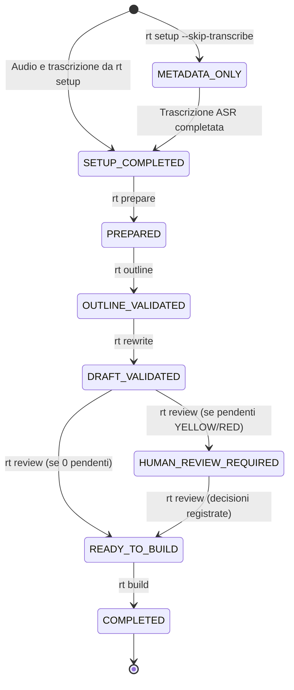

# Specifiche del Workflow e Ciclo di Vita

Questo documento descrive le fasi operative, le transizioni di stato e le garanzie di idempotenza del workflow RT 2.0.

---

## 1. Ciclo di Vita e Macchina a Stati

Ogni lezione possiede `info.yaml` e gli artefatti interni in `_state/`, incluso
`manifest.json`. I nomi degli artefatti nel seguito sono relativi a questa gestione;
`rt/core/lesson_paths.py` centralizza anche la compatibilità con i layout storici.
Il diagramma riassume il percorso principale (non tutte le transizioni di ripresa):



### Elenco Stati Formalizzati:
- `metadata_only`: cartella creata con metadati e audio ma senza trascrizione ASR (`--skip-transcribe`).
- `setup_completato`: cartella inizializzata con audio e trascrizione grezza (`trascritto grezzo.json`).
- `preparato`: `segments.json` e `transcript_normalized.md` creati, integrità temporale validata.
- `outline_validata`: scaletta didattica generata e verificata per monotonicità e copertura.
- `draft_validato`: unità didattiche rielaborate con traccia esplicita di `source_segment_ids`.
- `revisione_completata`: controllo scientifico e rilevamento delle ambiguità ASR eseguiti.
- `in_attesa_revisione_umana`: presenza di decisioni in attesa di risposta utente.
- `pronto_per_build`: tutte le anomalie risolte o esplicitate nel ledger.
- `completato`: file definitivi generati e cartella finalizzata.
- `fallito`: stato di errore bloccante nella pipeline, ripristinabile al rieseguimento.

---

## 2. Dettaglio delle Fasi

### Fase 1: Setup & Audio Ingest (`rt setup` / `rt run <audio>`)
- Modulo unificato `rt/pipeline/setup.py`.
- Riceve uno o più file audio (.m4a, .wav, .mp3...), la data, la materia e gli argomenti.
- In caso di file multipli, calcola l'offset cumulativo in millisecondi in modo deterministico e preserva la monotonicità temporale.
- Invoca `macparakeet-cli` per generare `trascritto grezzo.json` (Source of Truth assoluta) e `trascritto grezzo.md`.
- Con `--skip-transcribe`, imposta lo stato protetto `metadata_only`.
- Con `--mock`, genera un mock ASR deterministico offline a costo zero.
- Protezione sovrascrittura: rifiuta cartelle con avanzamenti senza `--force`, e con `--force` preserva sempre `review_decisions.json`.

### Fase 2: Prepare (`rt prepare`)
- Deterministica al 100%.
- Converte tutti i timestamp in secondi (`float`).
- Assegna ID permanenti `seg_000001` ... `seg_N`.
- Segnala gap superiori a 5s o sovrapposizioni nei flag dei segmenti senza alterare il testo sorgente.
- Crea `segments.json` e `transcript_normalized.md`.

### Fase 3: Outline (`rt outline` & `rt validate-outline`)
- L'LLM analizza i segmenti e crea una gerarchia di macro-argomenti e unità didattiche (2–6 minuti).
- Regola aurea: L'LLM restituisce solo `start_segment_id` ed `end_segment_id`.
- Lo script verifica che:
  - Tutti i segmenti esistano;
  - `start <= end`;
  - Le unità siano strettamente ordinate cronologicamente;
  - Non vi siano buchi inspiegati nel trascritto (report di copertura).

### Fase 4: Rewrite (`rt rewrite` & `rt validate-draft`)
- Per ogni unità, l'LLM riceve:
  - **Segmenti principali** (testo integrale da rielaborare);
  - **Contesto precedente** (ultimi 90 secondi per non perdere il filo);
  - **Contesto successivo** (prossimi 90 secondi per fluidità);
  - **Outline globale**;
  - **Glossario di riferimento**.
- Il draft salva obbligatoriamente `source_segment_ids`.

### Fase 5: Review unificata (`rt review`)
- Il comando unico sostituisce i precedenti comandi separati di review.
- Il critic confronta il rielaborato con la trascrizione e distingue `ERR_DOCENTE`,
  `ERR_RECONSTRUCTION` e `SCIENCE_CHECK`.
- Il rilevamento statistico ASR produce `ERR_ASR_ST`; l'opzione `--asr-llm` abilita
  il raffinamento LLM dei candidati statistici (`ERR_ASR_LLM`).
- Analisi e decisioni sono distinte: la CLI richiama la pipeline e poi la sessione
  interattiva tramite terminale o Telegram.

### Fase 6: Human-in-the-Loop Review (`rt review`)
- Mostra in cima l'identificativo e il titolo dell'Unità didattica, il timecode, il frammento ASR originale, la proposta AI e la motivazione.
- **Contesto Draft ASR**: per le ambiguità ASR estrae e mostra la singola frase pulita dal testo rielaborato dove cade il termine (`[termine]`), senza puntini di sospensione.
- **Contesto Draft Scienza**: per le critiche scientifiche mostra l'intero testo dell'unità didattica per una valutazione contestuale completa.
- Scelte interattive: `[A]ccetta`, `[R]ifiuta`, `[M]odifica testo`, `[S]alta`, `[Q]Esci e salva`.
- **Opzioni di auto-approvazione**:
  - `--auto-accept`: accetta automaticamente tutte le proposte (oppure `all`).
  - `--auto-accept yellow`: auto-accetta le proposte YELLOW (rimangono solo le ROSSE da controllare).
  - `--auto-accept red`: auto-accetta le proposte RED.
- Tutte le decisioni sono scritte in tempo reale in `review_decisions.json`.

### Fase 7: Deterministic Build (`rt build`)
- Assembla:
  - `pre-elaborato.md`: documento di lavoro con traccia temporale e marker formattati.
  - `rielaborato.md`: prosa accademica definitiva per lo studio.
  - `Revisioni ASR.md`: tabella con intervalli di ascolto audio.
  - `Errori concettuali.md`: registro dei lapsus del docente.
  - `Problemi scientifici.md`: registro delle verifiche scientifiche.
  - `[AAAA-MM-GG] MATERIA - Titolo.md`: copia formale.
- Applica le decisioni del ledger una sola volta in modo idempotente.

---

## 3. Idempotenza, Freschezza e Rerun Sicuro

A partire da RT 2.0, l'esecuzione di qualsiasi fase del workflow è progettata per essere **rigorosamente idempotente**, **economica** e **crash-safe**:

### 3.1 Separazione tra Ciclo di Vita e Freschezza degli Artefatti
- **`WorkflowState`**: descrive il progresso globale raggiunto dalla lezione nel flusso complessivo (es. `draft_validato`, `completato`).
- **`PhaseStatus`**: descrive in modo indipendente lo stato di freschezza di ciascun artefatto:
  - `VALID`: artefatto presente, conforme allo schema Pydantic/integrità, e fingerprint degli input + `processor_version` invariati. Viene saltato con **0 chiamate LLM e 0 costi aggiuntivi**.
  - `STALE`: un artefatto o input upstream è cambiato (o è stato invalidato da un rerun precedente). La fase viene rieseguita.
  - `MISSING`: l'artefatto non è ancora stato generato. La fase viene eseguita.
  - `INVALID`: l'artefatto su disco è corrotto o non supera la validazione formale. Viene rigenerato in sicurezza.

### 3.2 Fingerprinting Estensibile
Ogni fase registra nel manifest (`phase_records`):
- Gli hash SHA-256 dei file di input diretti;
- La versione del componente/prompt (`processor_version`), permettendo a future evoluzioni di prompt o parser di invalidare selettivamente gli artefatti anche a parità di file sorgente.

### 3.3 Matrice di Dipendenza e Invalidazione Downstream
Quando una fase produce un nuovo artefatto (per modifiche ai sorgenti o tramite flag `--force`), solo le fasi downstream dipendenti vengono marcate come `STALE`:
- Modifica a `prepare` (`segments.json`) $\rightarrow$ invalida `outline`, `rewrite`, `review`, `build`.
- Modifica a `outline` (`outline.json`) $\rightarrow$ invalida `rewrite`, `review`, `build`.
- Modifica a `rewrite` (`draft.json`) $\rightarrow$ invalida `review`, `build`.
- Modifica a `review` (`science_issues.json`) $\rightarrow$ invalida `build`.
- I file sorgente grezzi (`trascritto grezzo.*`, `audio.*`) e le decisioni umane registrate (`review_decisions.json`) **non vengono mai sovrascritti o cancellati**.

### 3.4 Rerun Parziale per Unità Didattica
Il comando `rt rewrite <dir> --unit <unit_id> --force` consente di rielaborare via LLM esclusivamente una specifica unità didattica. Le restanti unità già valide in `draft.json` vengono preservate senza consumare token aggiuntivi, e downstream viene invalidato solo ciò che dipende dal nuovo draft.

### 3.5 Crash-Safety
Tutti i file strutturati e i documenti Markdown vengono scritti atomicamente (`.tmp` temporaneo seguito da `os.replace`). Se il processo viene interrotto bruscamente, l'artefatto preesistente non viene corrotto e lo stato della macchina a stati non viene avanzato fino a validazione completata.

### 3.6 Diagnostica con `rt status`
Il comando:
```bash
./bin/rt status <percorso_lezione>
```
mostra sia lo stato globale del workflow sia la matrice dettagliata fase per fase con stato (`VALID`, `STALE`, `MISSING`, `INVALID`) e la motivazione esplicita per qualsiasi condizione di non-validità (es. `upstream changed`, `file missing`, `validation failed`).
